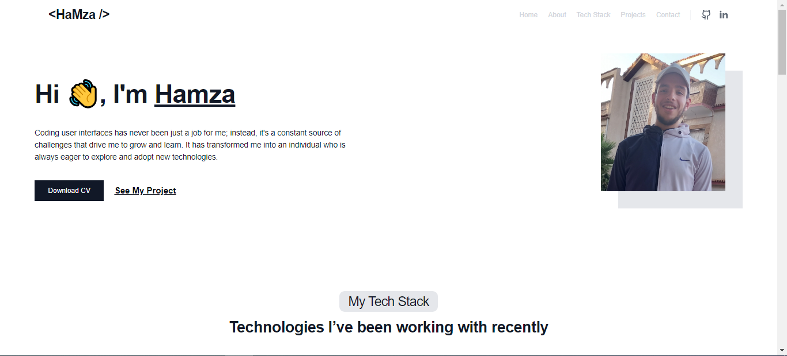

# Personal Portfolio
<p align="center">
  
</p>

here is live [here](https://abdrahim.netlify.app/)

## Description

This repository contains my personal portfolio, which serves as a showcase for my projects, skills, and achievements. The portfolio is designed to provide an overview of my professional background and expertise.

## Features

- Project showcase with detailed descriptions, images, and live demos
- Skills section highlighting my technical proficiencies
- About Me section providing background information and work experience
- Contact information to facilitate communication
- Responsive design for optimal viewing on different devices

## Installation

1. Clone the repository:

   ```bash
   git clone https://github.com/your-username/personal-portfolio.git

   Navigate to the project directory:
   cd personal-portfolio

   Install dependencies:
   npm install

   Start the development server:
   npm start

   Open your browser and visit http://localhost:3000 to view the portfolio.

- ## Technologies Used

I built My Personal Portfolio using the following technologies:

- React
- Tailwendcss

- ## Contact Information

- For any inquiries or feedback, please email me at essh4014@gmail.com . You can also connect with me on [LinkedIn](https://www.linkedin.com/in/hamza-abd-rahim-42bb93267/).
